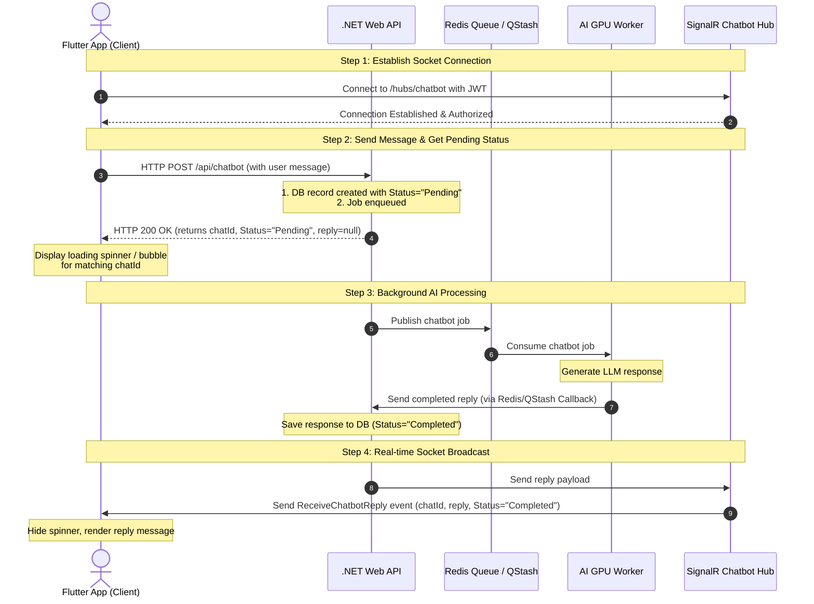

# ClinIQ AI Chatbot Integration Guide

This integration guide explains the hybrid flow used to interact with the ClinIQ AI Chatbot. 

To ensure a highly responsive user experience and handle heavy GPU workloads without blocking HTTP requests, the chatbot operates **asynchronously** using a hybrid model:
1. **Initiate Request**: The client sends a quick HTTP `POST` request to start a chat query. The backend immediately returns a `Pending` state with a unique `chatId`.
2. **Receive Response**: The client listens to a real-time SignalR socket. When the AI worker completes the response, the backend pushes the result directly to the client over the socket.

---

## 1. Sequence & Architecture Flow

The diagram below illustrates how client requests traverse the queue system to the GPU worker and return to the client in real-time.



---

## 2. Hub Details

| Parameter | Value | Description |
|---|---|---|
| **Hub URL** | `https://cliniq.runasp.net/hubs/chatbot` | Production endpoint |
| **Local URL (Android Emulator)** | `http://10.0.2.2:5000/hubs/chatbot` | Standard loopback interface for local testing |
| **Local URL (iOS Simulator / Web)** | `http://localhost:5000/hubs/chatbot` | Local address |
| **Authentication** | **Required** (JWT Bearer Token) | Passed in the connection options header |
| **Event Name** | `"ReceiveChatbotReply"` | The socket message callback you register |

### Authentication
Since the Hub is secured with `[Authorize]`, any connection attempt without a valid token will be rejected with an HTTP `401 Unauthorized` status. You must supply the JWT token obtained from `/api/auth/login` inside the SignalR connection headers (`accessTokenFactory`).

---

## 3. Step-by-Step Integration

### Step 1: Connect and Subscribe to the Hub
Establish the connection when the chat screen loads. Make sure to register the listener for `ReceiveChatbotReply` before starting the connection.

Here is a minimal Dart example using the `signalr_netcore` package:

```dart
import 'package:signalr_netcore/signalr_netcore.dart';

// 1. Configure authentication and connection options
final httpOptions = HttpConnectionOptions(
  accessTokenFactory: () async => "YOUR_JWT_ACCESS_TOKEN",
);

final hubConnection = HubConnectionBuilder()
    .withUrl("http://10.0.2.2:5000/hubs/chatbot", options: httpOptions)
    .withAutomaticReconnect()
    .build();

// 2. Register callback for chatbot replies
hubConnection.on("ReceiveChatbotReply", (arguments) {
  if (arguments != null && arguments.isNotEmpty) {
    final Map<String, dynamic> payload = arguments.first as Map<String, dynamic>;
    
    final String chatId = payload['chat_id'];
    final String status = payload['status']; // "Completed" | "Failed"
    final String? replyText = payload['reply'];
    
    print("Received reply for chat $chatId: $replyText");
    // TODO: Update your UI state matching this chatId
  }
});

// 3. Start connection
await hubConnection.start();
```

---

### Step 2: Trigger a Query via HTTP POST
Send a standard HTTP request to submit a new message.

* **Endpoint**: `POST /api/chatbot`
* **Headers**: `Authorization: Bearer <jwtToken>`
* **Body**:
  ```json
  {
    "message": "أشعر بألم شديد في الأسنان، ماذا أفعل؟",
    "languagePreference": "ar"
  }
  ```

* **Immediate Response**:
  ```json
  {
    "id": 105,
    "chatId": "3f2ca18128ad42e896495df027cf8bf2",
    "patientId": "patient_demo",
    "message": "أشعر بألم شديد في الأسنان، ماذا أفعل؟",
    "languagePreference": "ar",
    "status": "Pending",
    "reply": null,
    "queryType": null,
    "showUpload": false,
    "error": null,
    "createdAt": "2026-07-12T22:20:00Z",
    "finishedAt": null
  }
  ```

At this stage, **immediately append the user's message with a loading state** (like a thinking bubble) associated with the `chatId` value.

---

### Step 3: Listen for the Completed Reply (via Socket)
When the processing finishes, the backend pushes the reply payload to the registered `"ReceiveChatbotReply"` socket handler.

* **Event Payload Sample**:
  ```json
  {
    "chat_id": "3f2ca18128ad42e896495df027cf8bf2",
    "status": "Completed",
    "reply": "الصداع له أسباب كثيرة... يجب استشارة طبيب إذا استمر.",
    "query_type": "health",
    "show_upload": false,
    "patient_id": "patient_demo",
    "error": null,
    "worker": "lair-g2:chat",
    "duration_ms": 1840.5,
    "finished_at": "2026-07-12T22:20:02Z"
  }
  ```

Identify the message in your UI using the `chat_id` key, replace the loading spinner with the `reply` text, and change its state status to `"Completed"`.

---

### Step 4: Handle Special Directives (e.g., Scan Uploads)
If the socket response contains `"show_upload": true`, the AI chatbot has determined that the user wants to upload a medical scan or prescription.

> [!IMPORTANT]
> **Action Required**: When `show_upload` is `true`, the Flutter app should display a button or option to upload an image. The selected image should be sent via an HTTP POST request to the **Modal AI Scan Jobs** endpoint (`/api/scans/upload`), **not** to the chatbot endpoint.
